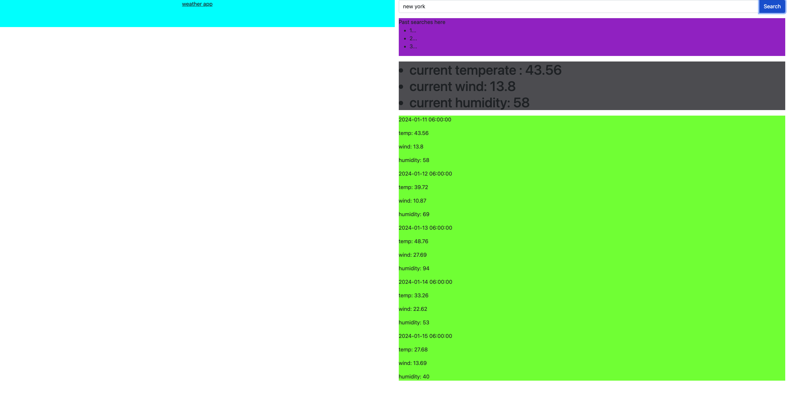
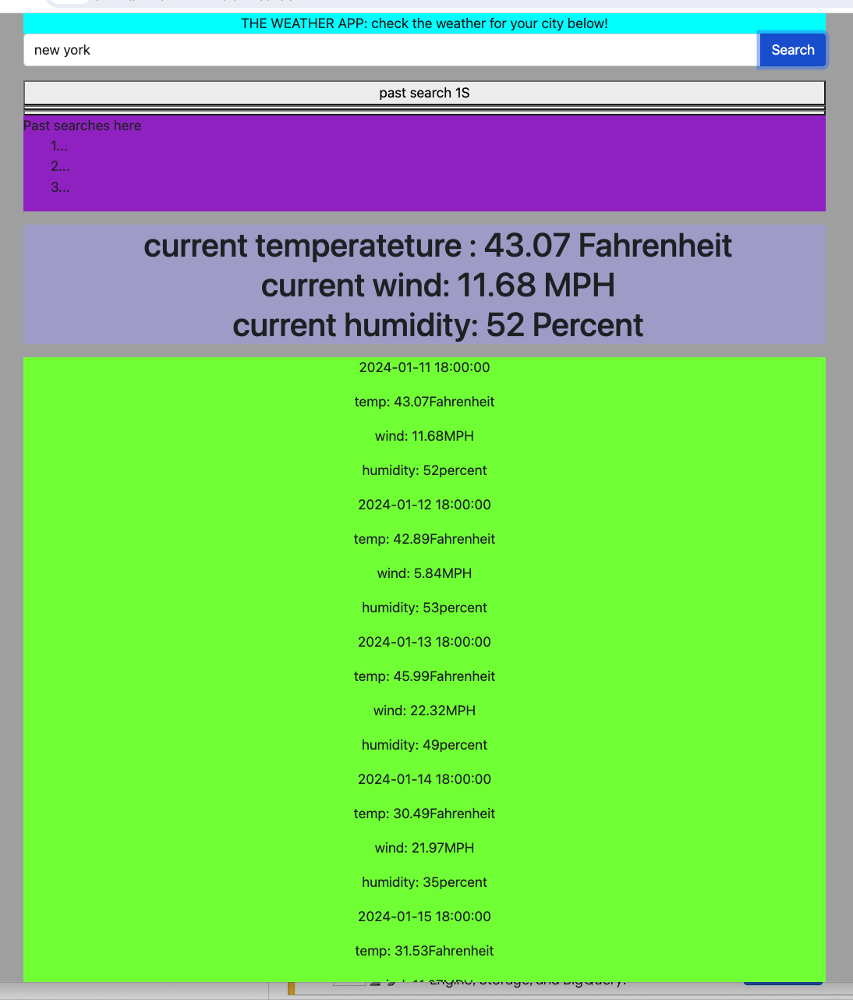

# openAppApi
This is a repo for the weather app that connects with open weather API

The user can search for a city.  The cities current information will be displayed.
including the temperature, wind speed and humidity. Also the Past searches will be displayed in a seperate section linked to buttons. Also the future weather will be displayed in a seperate section as well.

I used resources from the web MDN, tutors, classmates, Xpert Learning Assistant, and youtube.

here is alink to the deplyed application :

https://johndennis2.github.io/openAppApi/